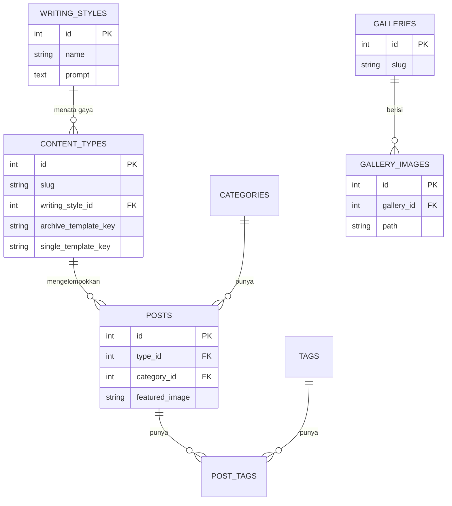
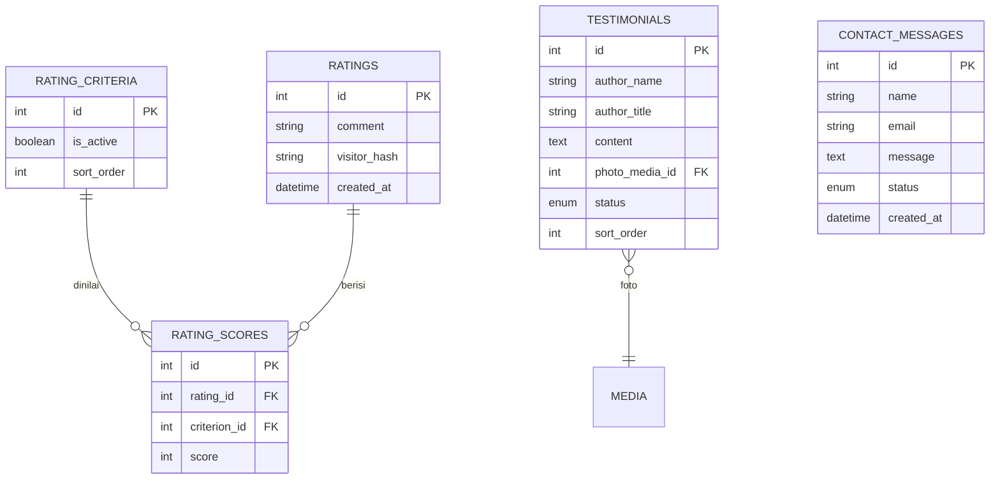
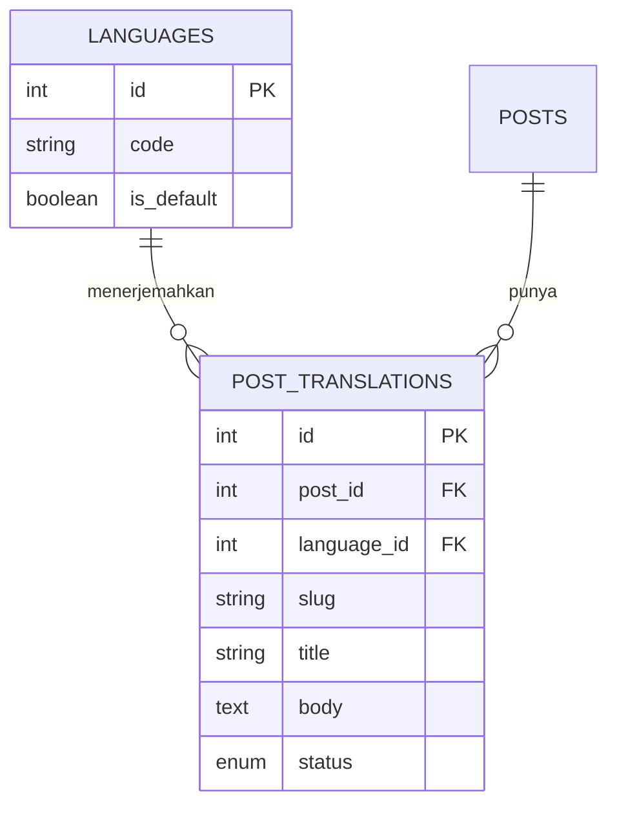

# PRD — Website Company Profile Berbasis CMS

**Versi:** 1.1 (Final)
**Tanggal:** 19 Juli 2026
**Status:** Final — spesifikasi inti lengkap (Open Item #3 sengaja ditunda, lihat Lampiran A)

> **Catatan dokumen:** v1.1 menyelaraskan PRD dengan spec desain pondasi: autentikasi **Laravel Fortify** (backend-only + passkeys/2FA), `site_settings` **hibrida** (`spatie/laravel-settings` + `setting_translations`), posisi widget diperkaya (before/after content), dan sanitasi HTML via `stevebauman/purify`. Open Item #3 (custom fields) tetap ditunda (Lampiran A).

---

## 1. Ringkasan

Website *company profile* berbentuk **CMS** (layaknya WordPress/Joomla) yang dapat dikelola **tanpa menyentuh kode**. Bersifat **umum** (pemerintah maupun non-pemerintah), **multi-bahasa**, dengan fitur AI (**terjemahan**, **koreksi gaya bahasa**, dan **penyesuaian markup**) serta fitur **interaksi pengunjung** (kontak, testimoni, penilaian).

---

## 2. Latar Belakang & Tujuan

Website statis "beku"; yang dibutuhkan adalah sistem dinamis, multi-bahasa, dan fleksibel yang dapat dikelola mandiri. Karena ditujukan untuk berbagai organisasi, hal-hal bergaya (register bahasa) dibuat konfigurabel. Rujukan: WordPress & Joomla.

**Tujuan situs & bidang organisasi** bersifat per-penerapan (Open Items).

---

## 3. Konsep Inti — Arsitektur Dua Lapisan

- **Frontend** — dilihat pengunjung (multi-bahasa via locale).
- **Backend (dashboard admin)** — mengelola konten dan konfigurasi.

Seluruh konten frontend bersifat dinamis, ditarik dari database.

---

## 4. Struktur Halaman

### 4.1 Konten (Content Type)
Satu tabel `posts`, dikelompokkan `content_types` (dapat ditambah lewat admin). Semua jenis berbagi struktur; pembeda: rute arsip, label, template, dan gaya bahasa. Galeri terpisah.

### 4.2 Custom Page
Dibuat lewat dashboard tanpa menyentuh codebase; disimpan di `pages`, ditampilkan lewat route catch-all (Laravel routing).

---

## 5. Mode Konten (Toggle per Halaman)

Saklar dua mode yang **hanya mengendalikan area konten**:

- **Mode Code AKTIF** — merancang area konten sendiri. **Khusus role Admin.**
- **Mode Code NONAKTIF** — memilih template hardcode.

### 5.1 Rincian Mode Code (HTML-saja)

- Yang ditulis dan disimpan hanya **HTML** (struktur), pada `content` per bahasa. **CSS dan JS bersifat global** (satu untuk seluruh situs) — tidak ditulis per halaman.
- Saat dirender, HTML dimasukkan ke cangkang halaman, di-style CSS global, lalu di-*enhance* JS global yang memindai class/atribut untuk memasang perilaku komponen.
- **Bantuan AI (`MARKUP_CONFORM`)**: HTML buatan admin dikoreksi AI agar sesuai class/struktur design system, memakai **referensi komponen** (katalog class + markup yang benar) yang diberikan ke AI sebagai konteks. Hasil tampil sebagai saran (Terima/Sunting/Batalkan) dengan **pratinjau langsung**.
- **Batasan:** interaktivitas terbatas pada komponen yang sudah disediakan JS global; interaksi baru = tugas developer menambah JS global, bukan lewat mode code.
- **Keamanan:** HTML disanitasi (buang `<script>` dan atribut `on*`); tidak ada JS inline.

> Region di sekelilingnya tetap konsisten, apa pun modenya.

---

## 6. Region / Tata Letak (Cangkang Halaman)

| Region | Perilaku | Keterangan |
|---|---|---|
| Navigation menu (header) | **Global** | Diatur sekali di pengaturan situs. |
| Footer | **Global** | Sama di semua halaman. |
| Hero section | **Per-halaman** | On/off; gambar latar global, teks diterjemahkan. |
| Sidebar | **Per-halaman** | On/off. |
| Widget | **Per-halaman** | Penempatan Joomla-style. |

### 6.1 Halaman dan Menu (Terpisah)
Slug selalu ada; keanggotaan menu opsional lewat opsi "Tambahkan ke menu?". Target menu via `link_type` + `link_ref`: PAGE / CONTENT_ARCHIVE / CONTENT_SINGLE / URL.

---

## 7. Model Data

Multi-bahasa **Opsi B** (tabel terjemahan terpisah).

### 7.1 Kelompok Konten

**`languages`** — `id`, `code`, `name`, `is_default`, `is_active`, `sort_order`

**`writing_styles`** — `id`, `name`, `prompt`

**`content_types`** — `id`, `slug`, `icon`, `writing_style_id` (FK), `archive_template_key`, `single_template_key`, `is_active`, `sort_order`
**`content_type_translations`** — `id`, `content_type_id` (FK), `language_id` (FK), `name`, `description`

**`posts`** — `id`, `type_id` (FK), `category_id` (FK), `featured_image`
**`post_translations`** — `id`, `post_id` (FK), `language_id` (FK), `slug`, `title`, `body`, `status` (enum: DRAFT/PUBLISHED), `published_at`, `meta_title`, `meta_description`

**`categories`** / **`category_translations`** (`name`)
**`tags`** / **`tag_translations`** (`name`)
**`post_tags`** — `post_id` (FK), `tag_id` (FK)
**`galleries`** / **`gallery_translations`** (`title`, `description`)
**`gallery_images`** (`path`, `sort_order`) / **`gallery_image_translations`** (`caption`)

### 7.2 Kelompok Halaman & Tata Letak

**`pages`** — `id`, `mode` (enum: CODE/TEMPLATE), `template_key`, `hero_enabled`, `hero_image`, `sidebar_enabled`
**`page_translations`** — `id`, `page_id` (FK), `language_id` (FK), `slug`, `title`, `content` (JSON/HTML), `hero_heading`, `hero_subheading`, `hero_cta_text`, `hero_cta_link`, `status`, `meta_title`, `meta_description`

**`menus`** — `id`, `name`, `location` (enum: HEADER/FOOTER)
**`menu_items`** — `id`, `menu_id` (FK), `parent_id` (FK), `link_type` (enum), `link_ref`, `url`, `sort_order`
**`menu_item_translations`** — `id`, `menu_item_id` (FK), `language_id` (FK), `label`

**`widgets`** — `id`, `type` (enum), `config` (JSON) / **`widget_translations`** (`title`, `content`)
**`widget_placements`** — `id`, `widget_id` (FK), `position` (enum: BEFORE_CONTENT/AFTER_CONTENT/SIDEBAR/FOOTER), `scope` (enum: ALL/ONLY/EXCEPT), `sort_order`
**`widget_placement_targets`** — `placement_id` (FK), `target_type` (enum: PAGE/CONTENT_ARCHIVE/CONTENT_SINGLE), `target_ref` (polimorfik, mengikuti pola `menu_items`)

### 7.3 Tabel Pendukung & Interaksi Pengunjung

**`media`** — `id`, `filename`, `path`, `mime_type`, `size`, `alt`, `uploaded_by` (FK), `created_at`

**`users`** — `id`, `name`, `email`, `password_hash`, `role` (enum: ADMIN/EDITOR/AUTHOR)

**`site_settings`** (**hibrida**) — nilai **non-teks** (nama situs, logo, favicon, referensi menu header/footer, SEO default non-teks, **WhatsApp** `whatsapp_number`/`whatsapp_enabled`/`whatsapp_message`, sosmed, Maps) via `spatie/laravel-settings` (kelas Settings bertipe); nilai **teks yang diterjemahkan** (tagline, teks footer) via tabel `setting_translations` (`key`, `language_id`, `value`). Bukan satu tabel custom.

**`ai_configs`** — konfigurasi AI **per-tugas**.
- `id`, `task` (enum: **TRANSLATION / CONTENT_REFINEMENT / MARKUP_CONFORM**), `base_url`, `api_key` (terenkripsi, server-only), `model`, `system_prompt`, `enabled`

**`contact_messages`** — pesan dari form kontak.
- `id`, `name`, `email`, `phone`, `subject`, `message`, `status` (enum: NEW/READ/ARCHIVED), `created_at`

**`testimonials`** — testimoni (kurasi admin).
- `id`, `author_name`, `author_title`, `content`, `photo_media_id` (FK → `media`), `status` (enum: PENDING/APPROVED), `sort_order`, `created_at`

**`rating_criteria`** — kriteria penilaian (dapat dikelola admin).
- `id`, `is_active`, `sort_order`
**`rating_criteria_translations`** — `id`, `criterion_id` (FK), `language_id` (FK), `name`

**`ratings`** — satu kali kirim penilaian.
- `id`, `comment`, `visitor_hash`, `created_at`

**`rating_scores`** — skor per kriteria dalam satu penilaian.
- `id`, `rating_id` (FK), `criterion_id` (FK), `score` (1–5)

*Kriteria penilaian bawaan (rekomendasi, dapat diubah): Kemudahan penggunaan, Kelengkapan informasi, Kecepatan akses, Tampilan & kenyamanan, Kepuasan keseluruhan.*

### 7.4 AI, Terjemahan & Multi-bahasa

Tiga tugas AI (`ai_configs`, per-tugas), semua dengan alur **saran → tinjau** (non-destruktif):
1. **TRANSLATION** — terjemahan antar-bahasa (mis. ByteDance).
2. **CONTENT_REFINEMENT** — koreksi/penyelarasan gaya bahasa; gaya per jenis konten via `writing_styles` (`content_types.writing_style_id`).
3. **MARKUP_CONFORM** — menyesuaikan HTML mode code ke class/komponen design system; `system_prompt` memuat **referensi komponen**.

Provider tiap tugas boleh berbeda. Pola terjemahan **Opsi B**: field teks pindah ke `*_translations` dengan `language_id` + `status` per-bahasa.

Poin penting: status & slug & meta SEO per-bahasa (frontend menghasilkan `hreflang`); hero dipecah (gambar inti, teks terjemahan); "human, bukan AI" dicapai lewat prompt gaya + tinjauan manusia (bukan jaminan mutlak).

### 7.5 Catatan Desain

- **Data, bukan enum:** jenis konten, bahasa, gaya bahasa, kriteria penilaian, dan konfigurasi AI berupa tabel — dapat ditambah lewat admin tanpa migrasi.
- **Mode code HTML-saja** + CSS/JS global; AI (`MARKUP_CONFORM`) menyesuaikan markup ke design system memakai referensi komponen.
- **AI per-tugas** (`ai_configs.task`) — provider/model/prompt independen.
- **Interaksi pengunjung:** form kontak (anti-spam + notifikasi), testimoni (moderasi), penilaian (agregasi rata-rata + pembatasan anti-spam).
- **Keamanan:** panggilan AI di server, API key terenkripsi; HTML mode code disanitasi; mode code khusus Admin.
- **Responsivitas:** desain **mobile-first** dengan breakpoint standar; responsivitas ditangani terpusat di CSS global (semua komponen & HTML ber-class ikut responsif); tata letak menyesuaikan (header → hamburger, sidebar menumpuk di bawah konten, hero mengecil, kolom menumpuk); **pratinjau mobile** di editor, khususnya untuk mode code.
- **SEO (wajib):** halaman publik **server-rendered**; meta/OG per-bahasa + `hreflang`; sitemap; structured data (JSON-LD); target **Core Web Vitals** baik (caching + CDN/reverse proxy opsional).
- **Aksesibilitas (wajib):** target **WCAG** — HTML semantik, ARIA, navigasi keyboard, manajemen fokus, kontras warna, alt text; primitif aksesibel dari shadcn/ui (Radix).
- **Gambar:** konversi otomatis ke **WebP** + varian ukuran responsif saat upload (file asli tetap disimpan; SVG dikecualikan) via `spatie/laravel-medialibrary`.

### 7.6 Catatan Routing

Arsip `/{slug-type}`, single `/{slug-type}/{slug-post}`, custom page via route catch-all (Laravel). Locale ID default, lainnya via prefix. Urutan pencocokan: locale → jenis konten → custom page → 404.

---

## 8. Struktur Admin CMS

### 8.1 Navigasi Sidebar

- **Dashboard** — ringkasan.
- **Konten** (grup): *entri per jenis konten (dinamis)*, Kategori, Tag, Galeri, Jenis konten.
- **Halaman** (grup): Semua halaman, Tambah halaman.
- **Tampilan** (grup): Menu, Widget, Template.
- **Interaksi** (grup): Pesan kontak, Testimoni, Penilaian.
- **Sistem** (grup): Media, Pengguna, Pengaturan.

### 8.2 Navigasi Jenis Konten Dinamis
Dibangkitkan dari `content_types` aktif; tiap jenis = entri tersendiri (pola WordPress).

### 8.3 Visibilitas Berdasarkan Role

| Role | Akses |
|---|---|
| **Admin** | Seluruh menu. |
| **Editor** | Konten, Halaman, Media, Interaksi. |
| **Author** | Konten miliknya sendiri, plus Media. |

- **Mode code** khusus Admin.

### 8.4 Layar Editor Halaman
Dua kolom (kolom utama: mode code/template; kolom pengaturan: hero, sidebar, "Tambahkan ke menu?", SEO, slug, status). Toggle bahasa + tombol **"Terjemahkan dengan AI"**, **"Koreksi dengan AI"**; pada mode code tersedia **"Sesuaikan markup (AI)"** + pratinjau.

### 8.5 Editor Konten
Field jenis/kategori/tag/gambar/judul/isi/status/tanggal/SEO. Toggle bahasa + **"Terjemahkan dengan AI"** + **"Koreksi dengan AI"** (gaya mengikuti jenis konten). Hasil AI = saran.

### 8.6 Pengaturan
- **Konfigurasi AI per-tugas** (`ai_configs`): TRANSLATION, CONTENT_REFINEMENT, MARKUP_CONFORM.
- **Gaya bahasa** (`writing_styles`), **Bahasa** (`languages`).
- **Kriteria penilaian** (`rating_criteria`).
- **WhatsApp** (nomor, aktif, pesan default), kontak & sosial, footer, SEO default.

---

## 9. Peta Fitur Lengkap

**1. Konten** — jenis konten dinamis; CRUD + editor visual; kategori & tag; galeri; status draft/publish.

**2. Halaman** — custom page dinamis; **mode code HTML-saja (Admin) + AI sesuaikan markup** / mode template; pemilih template; slug & SEO per halaman.

**3. Region & tata letak** — header & footer global; hero per-halaman; sidebar per-halaman; widget Joomla-style.

**4. Menu & navigasi** — menu header & footer; item hierarkis; target page/arsip/single/URL; opsi "tambahkan ke menu".

**5. Multi-bahasa & AI** — bahasa dinamis; terjemahan per entitas (Opsi B); status per-bahasa; terjemahkan dengan AI; koreksi gaya bahasa per jenis; penyesuaian markup (MARKUP_CONFORM); konfigurasi AI per-tugas + `writing_styles`.

**6. Media** — pustaka media; upload & kelola; **konversi otomatis ke WebP + varian responsif** (file asli disimpan, SVG dikecualikan); alt text.

**7. Pengguna & role** — Admin/Editor/Author; visibilitas per role; mode code khusus Admin.

**8. Pengaturan situs** — umum; SEO default; kontak & sosial; footer; AI, gaya bahasa, bahasa, kriteria penilaian.

**9. Frontend, SEO & teknis** — server-rendered (SEO); responsif/mobile-first (reflow: header → hamburger, sidebar menumpuk, hero mengecil; pratinjau mobile di editor); locale + pemilih bahasa; meta per-bahasa + `hreflang`; sitemap, Open Graph & structured data (JSON-LD); target Core Web Vitals; **aksesibilitas WCAG**; optimasi kecepatan; routing berlapis; HTTPS/SSL; keamanan AI.

**10. Interaksi & umpan balik pengunjung** — **tombol WhatsApp mengambang**; **form kontak** (+ notifikasi & anti-spam); **testimoni** (kurasi & moderasi); **penilaian website** (bintang 1–5 per kriteria, kriteria dapat dikelola, ditampilkan sebagai rata-rata).

---

## 10. Teknologi (Final)

Stack ditetapkan: **Laravel + Inertia + React**.

- **Backend:** Laravel 13 (PHP), Eloquent ORM; routing catch-all untuk custom page, jenis konten, dan locale.
- **Bridge & Frontend:** Inertia.js + **React**, Tailwind CSS, komponen **shadcn/ui** dan **Magic UI**. Halaman publik **server-rendered** (Inertia SSR / Blade) demi SEO.
- **Basis data:** **PostgreSQL** (JSONB untuk `content`, `config`, dan kelak `custom_fields`).
- **Autentikasi & role:** **Laravel Fortify** (login, reset, 2FA, passkeys — backend-only; halaman auth Inertia+React dibuat sendiri) + `spatie/laravel-permission` (Admin/Editor/Author).
- **Media:** `spatie/laravel-medialibrary` — konversi otomatis ke **WebP** + varian responsif saat upload (file asli disimpan; SVG dikecualikan).
- **Pengaturan situs:** `spatie/laravel-settings` (nilai non-teks) + tabel `setting_translations` (teks i18n).
- **Sanitasi HTML (mode code):** `stevebauman/purify` — allowlist tag/atribut + class design system, buang `<script>`/`on*`/`javascript:`.
- **AI:** **Laravel AI SDK** (`laravel/ai`) — base URL kustom ke endpoint OpenAI-compatible (mis. model terjemahan ByteDance); satu "agen" per tugas (TRANSLATION / CONTENT_REFINEMENT / MARKUP_CONFORM) dengan system prompt sendiri.
- **Multi-bahasa:** tabel `*_translations` (Opsi B) dikelola via Eloquent; routing locale.
- **Email & antrean:** mail + queue bawaan Laravel (notifikasi form kontak).
- **SEO:** server-rendered; `spatie/laravel-sitemap`; meta/OG per-bahasa + `hreflang`; JSON-LD; target Core Web Vitals (caching + CDN opsional).
- **Aksesibilitas:** target WCAG; primitif aksesibel shadcn/ui (Radix).
- **Hosting:** server PHP standar; ramah on-premise (VPS/kontainer), tanpa keharusan platform tertentu.

---

## 11. Ruang Lingkup Selanjutnya

Seluruh bagian yang direncanakan lengkap dan **seluruh Open Items tuntas** (kecuali #3 yang sengaja ditunda, Lampiran A). **Spesifikasi inti final.** Tahap berikutnya: implementasi, lalu meninjau kembali fitur ditunda setelah inti selesai.

Implementasi mengikuti **spec desain pondasi** (7 fase) dengan strategi ***walking skeleton*** — memvalidasi SSR/SEO/i18n lebih awal lewat irisan vertikal (1 jenis konten + 1 post render SSR per-locale dengan `hreflang`) sebelum melapis shell admin/publik dan layanan lintas-fungsi.

---

## 12. Hal yang Masih Perlu Ditetapkan (Open Items)

1. ~~Bentuk implementasi "mode code"~~ — **selesai (v0.5):** HTML-saja + CSS/JS global + AI `MARKUP_CONFORM`.
2. ~~Fitur pendukung opsional~~ — **selesai (v0.5):** WhatsApp mengambang, form kontak, testimoni, penilaian website.
3. **Custom fields per jenis konten** — **Ditunda** hingga fitur inti selesai; rancangan tercatat di Lampiran A (§A.1).
4. ~~Granularitas target penempatan widget~~ — **selesai (v0.7):** target polimorfik (custom page, arsip konten, single konten) via `widget_placement_targets`.
5. ~~Terjemahan alt-text media & detail teks widget~~ — **selesai (v0.8, pendekatan ramping):** satu `alt` dengan opsi override per bahasa (fallback default); teks widget via `widget_translations` (title/content), field tambahan per jenis widget saat dibutuhkan. Versi penuh dicatat di Lampiran A (§A.2).
6. ~~Finalisasi tech stack~~ — **selesai (v1.0):** Laravel 13 + Inertia + React; PostgreSQL + Eloquent; Laravel AI SDK; paket Spatie (`permission`, `medialibrary`, `sitemap`); Tailwind + shadcn/ui + Magic UI.
7. ~~Tujuan & bidang organisasi per-penerapan~~ — **ditutup (v0.8):** bukan keputusan level produk; dikonfigurasi per instance oleh organisasi pemakai. CMS dijaga netral-tujuan dan fleksibel.

---

## 13. Lampiran A — Catatan Fitur Ditunda

### A.1 Custom Fields per Jenis Konten (Open Item #3 — Ditunda)

**Status:** Ditunda hingga fitur inti selesai; dicatat agar konteks desainnya tidak hilang dan dapat dibahas kembali.

**Deskripsi:** Kemampuan mendefinisikan field tambahan khusus untuk jenis konten tertentu, di luar struktur `posts` standar (setara "Custom Fields"/ACF di WordPress). Contoh: "Produk" (harga, stok, berat), "Agenda" (tanggal, lokasi).

**Rancangan yang sudah dibahas (referensi saat dilanjutkan):**
- **Definisi field sebagai data** — tabel `field_definitions`: `content_type_id`, `key`, `label`, `field_type` (teks / teks panjang / angka / tanggal / boolean / select / media / URL), `required`, `options`, `sort_order`, `is_translatable`. Dirakit per jenis lewat admin tanpa migrasi.
- **Penyimpanan nilai — dua opsi:**
  - *Kolom JSON* (`custom_fields` di `posts`) — simpel, fleksibel, paling nyaman di Postgres (JSONB). Rekomendasi awal.
  - *Tabel nilai/EAV* (`post_field_values`) — lebih relasional, unggul untuk filter/urut berdasarkan field khusus, tapi lebih berat.
- **Multi-bahasa:** `is_translatable` menentukan penyimpanan — nilai teks yang diterjemahkan per-bahasa; nilai non-teks (harga, tanggal) sekali saja.
- **Ketergantungan:** pilihan JSON vs EAV sebagian bergantung pada tech stack (Open Item #6).
- **Alasan ditunda:** kompleksitas tertinggi di antara fitur yang dibahas (pada dasarnya "field builder" mini); dikerjakan setelah inti selesai.

### A.2 Terjemahan Mendalam (Open Item #5 — Sebagian Ditunda)

**Status:** Pendekatan ramping dipakai sekarang; versi penuh ditunda sebagai poles.

- **Sekarang (ramping):** satu `media.alt` dengan opsi override per bahasa (fallback ke default); teks widget lewat `widget_translations` (title/content); field teks tambahan ditangani per jenis widget saat dibutuhkan.
- **Ditunda (versi penuh):** alt-text per bahasa penuh (tabel `media_translations`) dan penerjemahan teks yang terselip di dalam `config` widget. Dibahas kembali bila kebutuhan poles multi-bahasa meningkat.

---

## 14. Riwayat Versi

| Versi | Tanggal | Perubahan |
|---|---|---|
| 0.1 | 19 Juli 2026 | Draft awal: konsep CMS, arsitektur dua lapisan, struktur halaman, mode konten, region. |
| 0.2 | 19 Juli 2026 | Model Data lengkap: jenis konten dinamis + template per jenis; widget Joomla-style; halaman ↔ menu terpisah. |
| 0.3 | 19 Juli 2026 | Struktur Admin CMS; fitur AI Terjemahan multi-bahasa (Opsi B). |
| 0.4 | 19 Juli 2026 | Peta Fitur Lengkap; koreksi konten AI + gaya bahasa per jenis (`writing_styles`); AI per-tugas (`ai_configs`); positioning umum. |
| 0.5 | 19 Juli 2026 | **Mode code difinalkan:** HTML-saja + CSS/JS global + AI `MARKUP_CONFORM` (dengan referensi komponen). **Fitur interaksi pengunjung:** tombol WhatsApp mengambang, form kontak (`contact_messages`), testimoni (`testimonials`), penilaian website (`rating_criteria` + `ratings` + `rating_scores`). Grup admin "Interaksi" ditambahkan; pilar fitur ke-10 ditambahkan. |
| 0.6 | 19 Juli 2026 | **Open Item #3 (custom fields per jenis konten) ditunda** — rancangan lengkap dicatat di Lampiran A untuk dibahas kembali setelah fitur inti selesai. |
| 0.7 | 19 Juli 2026 | **Open Item #4 (target penempatan widget) selesai** — target polimorfik (custom page, arsip, single) via `widget_placement_targets`. **Requirement responsif/mobile-first diperkuat** (reflow layout, responsivitas terpusat di CSS global, pratinjau mobile). |
| 0.8 | 19 Juli 2026 | **Open Item #5 (terjemahan alt-text & teks widget) diselesaikan ramping** (satu alt + override opsional; teks widget via title/content); versi penuh dicatat di Lampiran A.2. **Open Item #7 ditutup** sebagai setelan per-penerapan. Tersisa #6 (tech stack). |
| 1.0 | 19 Juli 2026 | **Tech stack difinalkan (Open Item #6):** Laravel 13 + Inertia + **React**, PostgreSQL + Eloquent, **Laravel AI SDK** (endpoint OpenAI-compatible), paket Spatie (`permission`, `medialibrary`, `sitemap`), Tailwind + shadcn/ui + Magic UI. **Requirement SEO, aksesibilitas (WCAG), dan konversi gambar WebP** ditambahkan eksplisit. Referensi routing disesuaikan ke Laravel. Seluruh Open Items tuntas kecuali #3 (ditunda). **Spesifikasi inti final.** |
| 1.1 | 19 Juli 2026 | **Selaras dengan spec desain pondasi.** Autentikasi **Fortify** (backend-only, passkeys/2FA); `site_settings` **hibrida** (`spatie/laravel-settings` + `setting_translations`); posisi widget diperkaya (BEFORE_CONTENT/AFTER_CONTENT/SIDEBAR/FOOTER); sanitasi HTML `stevebauman/purify`; strategi implementasi *walking skeleton* dicatat. |
